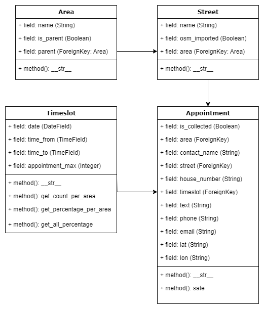

WBSA-Tool
=========
Die Weihnachtsbaum-Sammelaktion (WBSA) ist eine jährliche Aktion der [Jugendfeuerwehr Durlach](https://www.ff-durlach.de/jugendfeuerwehr/).
An mehreren Tagen anfang Januar fahren die Jugendlichen und Ausbilder durch den Stadtteil und sammeln gegen eine freiwillige Spende die Weihnachtsbäume ein. In den letzten Jahren wurde dies analog mit Papierlisten durchgeführt, darum habe ich mich über das Jahr 2023 mit Python-Django und anderen Dingen auseinandergesetzt um den gesamten Prozess um die Sammlung herum zu digitalisieren.

Anders als bei den umliegenden Jugendfeuerwehren fahren wir die Adressen der abzuholenden Bäume gezielt an und vereinbaren hierfür Termine mit den Menschen. Darum ist die Sammlung ist in zwei verschiedene Hauptaufgaben gegliedert: die Terminvereinbarung und die eigentliche Sammlung. Das WBSA-Tool deckt beide Bereiche ab.

Terminvereinbarung
------------------
Die Termine in Durlach werden entweder per E-Mail oder per Telefon vereinbart. Das Formular zur Terminvereinbarung ist auf eine gute Benutzbarkeit während des Telefonates optimiert.
In der Maske werden alle relevanten Daten für die Abholung erfasst.

Das Textfeld für die Auswahl der Straßen ist mit einem Dropdown & autocomplete ausgestattet, sodass beim Eintippen der Straße die Vorschläge gefiltert werden.

Sollte es bereits Abholungen in derselben Straße geben werden Vorschläge für den Abholungszeitraum gemacht, damit man möglichst viele Abholungen in selben Straße zur selben Zeit machen kann.

Nach Eingabe der vollständigen Adresse wird ein gelber Marker auf der Karte gesetzt. So ist es möglich die Abholungen in der Nähe zu der neuen Abholung zu sehen um den besten Zeitraum auswählen zu können.

Die Sammlung
------------
Während der Sammlung ist es möglich die Abholungen in einer Liste nach Zeitraum zu filtern und als abgeholt zu markieren:

 

Details zur Struktur des Tools
==============================

Das Tool verwendet mehrere Datenmodelle, um die Sammlung abzubilden:
- Gebiet / Fahrzeug
- Straße
- Abholungszeitraum
- Abholung

Diese hängen wie folgt zusammen:

<h3>Gebiete & Fahrzeuge</h3>
Gebiete und Fahrzeuge sind dasselbe Datenmodell, Fahrzeuge sind lediglich übergeordnete Gebiete. So kann man die verschiedenen Ortsteile gruppieren und diese Gruppen dann den verschiedenen Fahrzeugen, die man zur Verfügung hat, zuteilen.

<h3>Straßen</h3>
Die Straßen haben neben ihrem Namen noch zwei weitere Felder; einmal sind sie einem Gebiet zugeordnet und haben ein "osm_imported" Flag. Dieses zeigt an, ob eine Straße aus OpenStreetMap importiert wurde oder ob sie manuell angelegt wurde. Dieses Flag ist lediglich zur internen Verwendung und auch der OSM-Import ist aktuell nicht im User-Interface sichtbar.

<h3>Abholungszeiträume</h3>
Die Abholungszeiträume haben ein Datum, eine Start- und Endzeit. Zusätzlich gibt es die Möglichkeit eine maximale Menge an Abholungen festzulegen, welche in diesem Zeitraum durchgeführt werden können.

<h3>Abholungen</h3>
Die Abholungen enthalten alle relevanten Daten, damit ein Baum abgeholt werden kann. Zusätzlich ist es möglich eine Abholung als "abgeholt" zu markieren.
Beim Speichern der Abholung wird die Adresse der mittels der Nominatim-API von OpenStreetMap in GPS-Koordinaten umgewandelt und ebenfalls gespeichert. Diese Koordinaten werden von der Übersichtskarte verwendet.
Es ist möglich ein Fahrzeug direkt an ein Fahrzeug zu binden. Diese Funktion ist für einen Ausgleich der Abholungen der verschiedenen Fahrzeige gedacht. In der Praxis sind die Fahrzeuge im selben Zeitraum oft nicht gleichmäßig ausgelastet und so können einzelne Abholungen an ein anderes Fahrzeug mit einer niedrigen Auslastung disponiert werden.